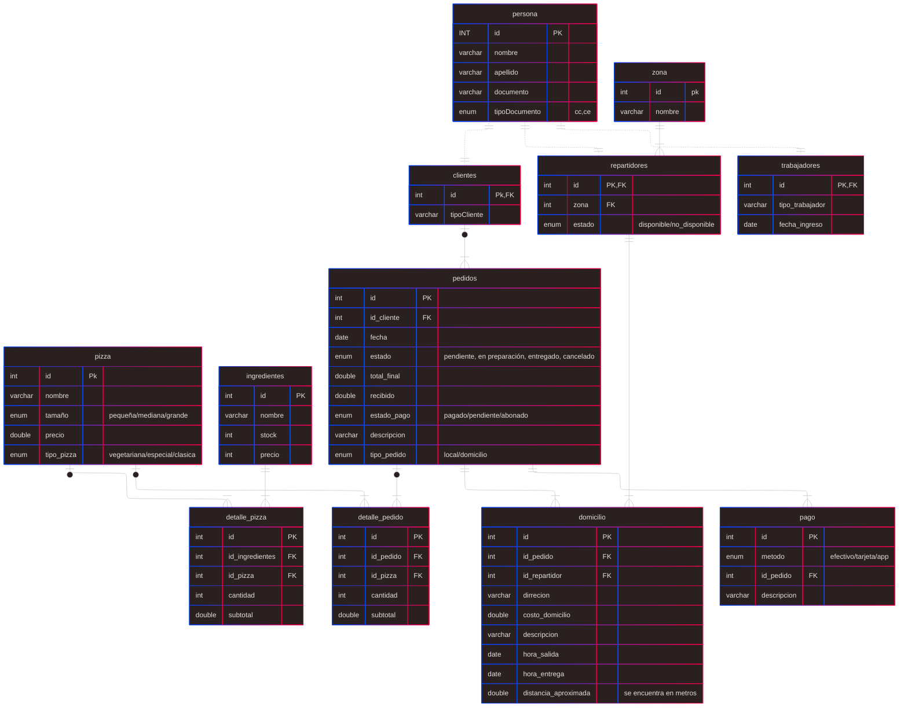

# Descripcion del Proyecto
Este proyecto es un sistema de gestión de pedidos para una pizzería llamada "Pizzeria Don Piccolo". El sistema está diseñado para manejar la creación y gestión de una base de datos que almacena información sobre clientes, repartidores, pizzas, pedidos y zonas de entrega. Además, incluye procedimientos almacenados para realizar consultas complejas y obtener información relevante sobre las operaciones de la pizzería.
## Estructura del Proyecto
El proyecto sigue la siguiente estructura:

```
📁pizzeria-don-piccolo/
├── database.sql      # Script para creación de la base de datos y tablas con relaciones y la insercion de datos.
├── funciones.sql     # Script para funciones (en construcción).
├── triggers.sql      # Script para triggers (en construcción).
├── vistas.sql        # Script para creación de vistas, (view).
├── consultas.sql     # Script para creación de consultas SQL complejas(procedure).
└── README.md         # Este archivo con documentación.
```
## Explicación de las tablas y relaciones
El archivo [database.sql](pizzeria-don-piccolo/database.sql) contiene el script para crear la base de datos y las tablas necesarias para el sistema de gestión de pedidos. A continuación, se describen las tablas principales y sus relaciones:
- **Persona**: Tabla que almacena información básica de las personas, incluyendo clientes y repartidores.
- **Clientes**: Tabla que almacena información específica de los clientes, relacionada con la tabla Persona.
- **Repartidores**: Tabla que almacena información específica de los repartidores, relacionada con la tabla Persona.
- **Zonas**: Tabla que almacena las zonas de entrega.
- **Pizzas**: Tabla que almacena información sobre las pizzas disponibles en el menú.
- **Pedidos**: Tabla que almacena información sobre los pedidos realizados por los clientes, incluyendo referencias a los clientes, repartidores y zonas de entrega.
- **Detalle_Pedidos**: Tabla que almacena los detalles de cada pedido, incluyendo las pizzas solicitadas y sus cantidades.
Las relaciones entre las tablas se establecen mediante claves foráneas, asegurando la integridad referencial y permitiendo consultas complejas para obtener información relevante sobre los pedidos, clientes y repartidores.

## funciones.sql
El archivo [funciones.sql](pizzeria-don-piccolo/funciones.sql) está destinado a contener funciones personalizadas que pueden ser utilizadas para realizar operaciones específicas dentro de la base de datos. Actualmente, este archivo está en construcción y se agregarán funciones en futuras actualizaciones.

## triggers.sql
El archivo [triggers.sql](pizzeria-don-piccolo/triggers.sql) está destinado a contener triggers que se activan automáticamente en respuesta a ciertos eventos en la base de datos, como inserciones, actualizaciones o eliminaciones. Actualmente, este archivo está en construcción y se agregarán triggers en futuras actualizaciones.

## vistas.sql
El archivo [vistas.sql](pizzeria-don-piccolo/vistas.sql) contiene el script para crear vistas (views) en la base de datos. Las vistas son consultas predefinidas que permiten acceder a datos de manera simplificada y estructurada. Estas vistas facilitan la obtención de información relevante sin necesidad de escribir consultas complejas cada vez.

## consultas.sql
El archivo [consultas.sql](pizzeria-don-piccolo/consultas.sql) contiene el script para crear consultas SQL complejas utilizando procedimientos almacenados (procedures). Estas consultas permiten obtener información detallada sobre las operaciones de la pizzería, como el historial de pedidos, la eficiencia de los repartidores y las preferencias de los clientes. Actualmente, este archivo incluye varias consultas que proporcionan información valiosa para la gestión del negocio.

me puedes añadir al readme la explicacion de mi mer y lo añadas
 




